# Dasuney+

**ssafy 10기 관통프로젝트**

## 🎈 프로젝트 개요

### 1. 프로젝트명

Dasuney+ (다주니 === 영화 추천 다 준다는 뜻 )

### 2. 프로젝트 주제

Django와 Vue.js를 활용한 영화 추천 커뮤니티 웹사이트

### 3. 팀명

you, 신나? 웅!

### 4. 프로젝트 기간

2023.11.16.(목) - 2023.11.23(목)

### 5. 기술 스택

  
  
  
  
  

### 6. 담당 역할

| 이름   | 담당                                                                                       |
| ------ | ------------------------------------------------------------------------------------------ |
| 문신웅 | 팀장, 백엔드 커뮤니티(리뷰, 댓글) CRUD 구현, 프론트엔드 CSS 개발 및 기능 구현              |
| 정유나 | 백엔드 영화추천알고리즘, 영화, 배우, 감독 조회, 좋아요, 프로필 기능 구현, 프론트 기능 구현 |

## 🎈 프로젝트 컨셉 및 주요 기능

### ✨ 프로젝트 컨셉

**✨오직 나를 위한 영화관✨**

- 영화관을 가지 않아도 OTT 서비스 등 시간과 장소에 제약에서 많이 자유로워 진 요즈음
  영화를 좋아하는 나는 바쁜 현대 사회 속에서 시간을 내어 영화를 보려고 한다.
  무수히 많은 영화들 속에서 금쪽 같은 내 시간이 아깝지 않은 영화를 바로 선택할 방법은 없을까?
- “사람”들의 평가 및 추천 혹은 데이터 상의 추천을 믿고 영화를 시청 했지만 내 취향이 아니거나
  재미가 없었던 경험은 누구나 한번 쯤 있을 것으로 생각된다.
- 그렇기에 불특정 다수의 추천이 아닌 오로지 “나”를 중심으로 영화를 추천해주는
  개인 맞춤 영화 추천 서비스

### 🔧 주요기능

- 일반 로그인 / 회원가입
- 사용자별 프로필 페이지
- 팔로우 팔로잉
- 영화 목록 조회 (최신, 인기, 추천)
- 영화 상세 조회
- 영화 및 인물 좋아요
- 인물 상세 조회
- 영화 평점 기능
- 영화 리뷰 커뮤니티

### 🔧 영화 추천 알고리즘

1. 내가 '보고싶어요'를 누른 영화와 '평점'을 준 영화들의 장르에 점수를 부여하여 가장 점수가 높은 장르의 영화를 추천
2. 나랑 '보고싶어요'를 누른 영화가 겹친 사용자의 '보고싶어요' 영화를 추천해줌

## 🎈 서비스 화면

### <메인페이지>

### intro

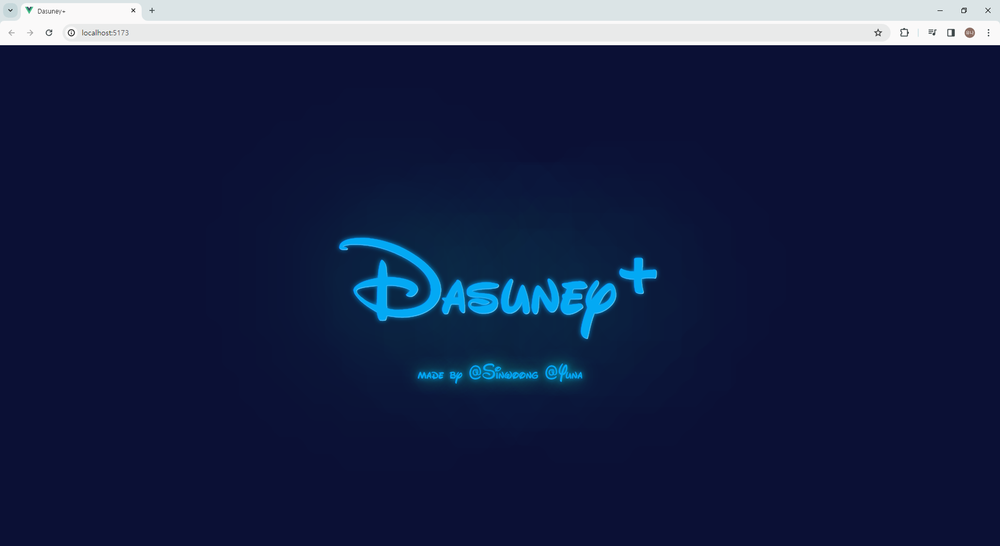

### 로그인하지 않았을 때

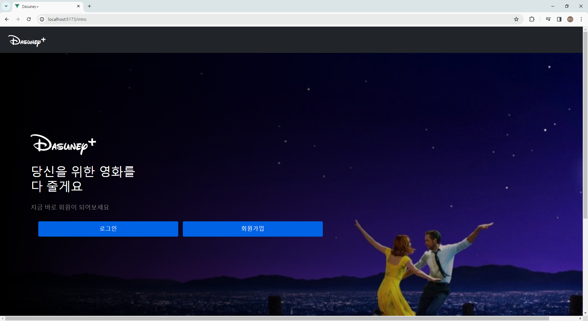

### 로그인 상태일때

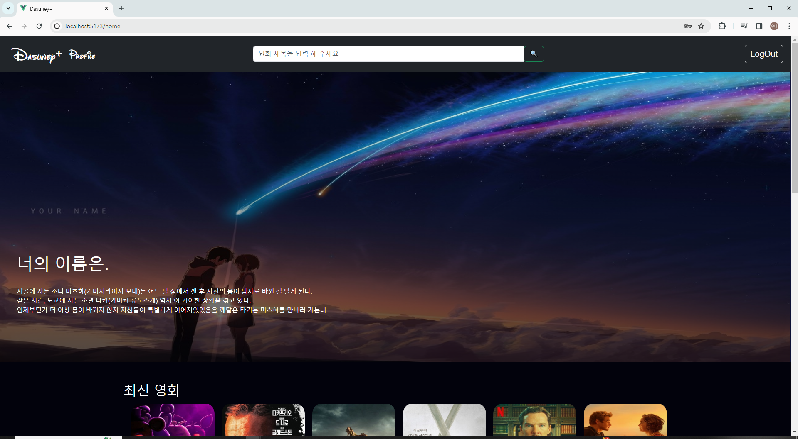

### home 화면에서 영화 조회

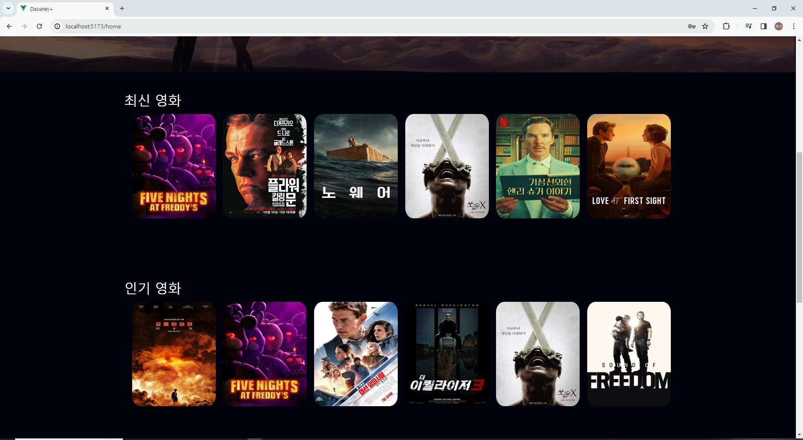
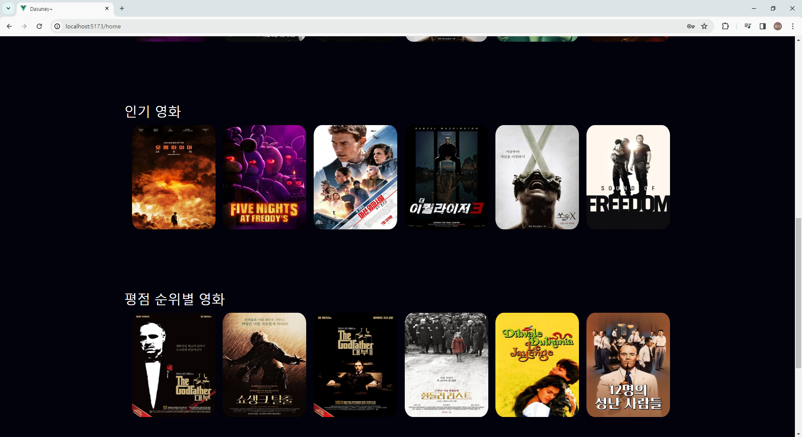

### home 화면서에 알고리즘에 따른 추천 영화 조회

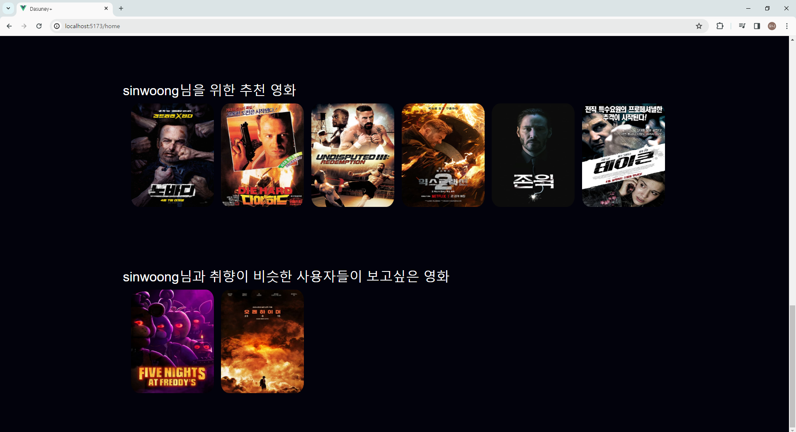

### <영화 상세 조회>

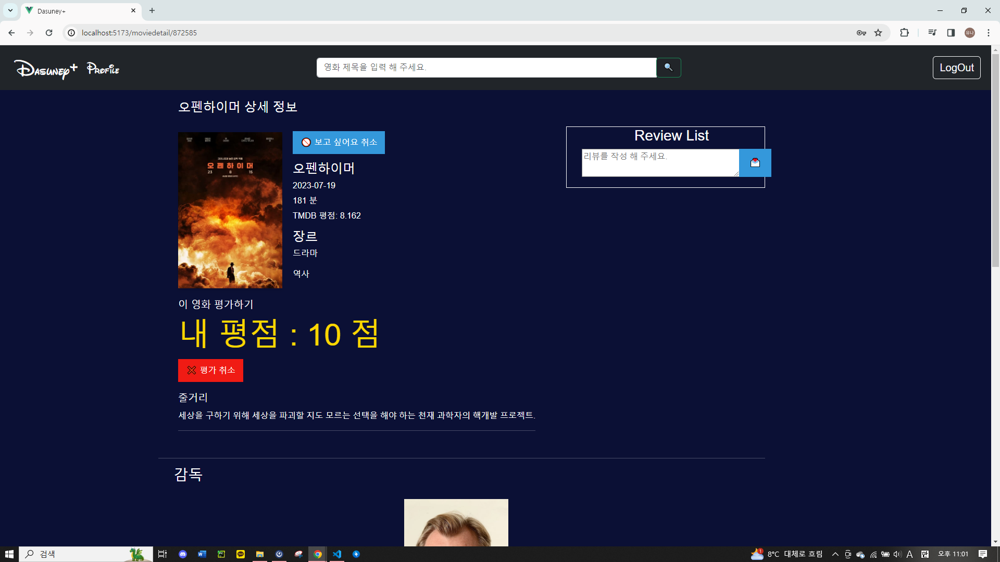

- 평점기능
- 보고싶어요 선택 가능
- 영화 참여한 감독과 배우 조회 및 좋아요 기능
- 감독 or 배우 클릭 시 해당 인물 상세 조회 가능

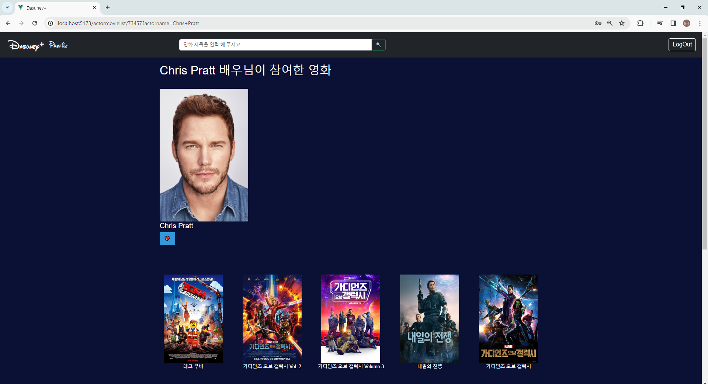

### <커뮤니티 기능>

- 해당 영화에 대한 리뷰 작성 가능
- 내가 작성한 리뷰와 다른사람이 작성한 리뷰 모두 조회 가능
  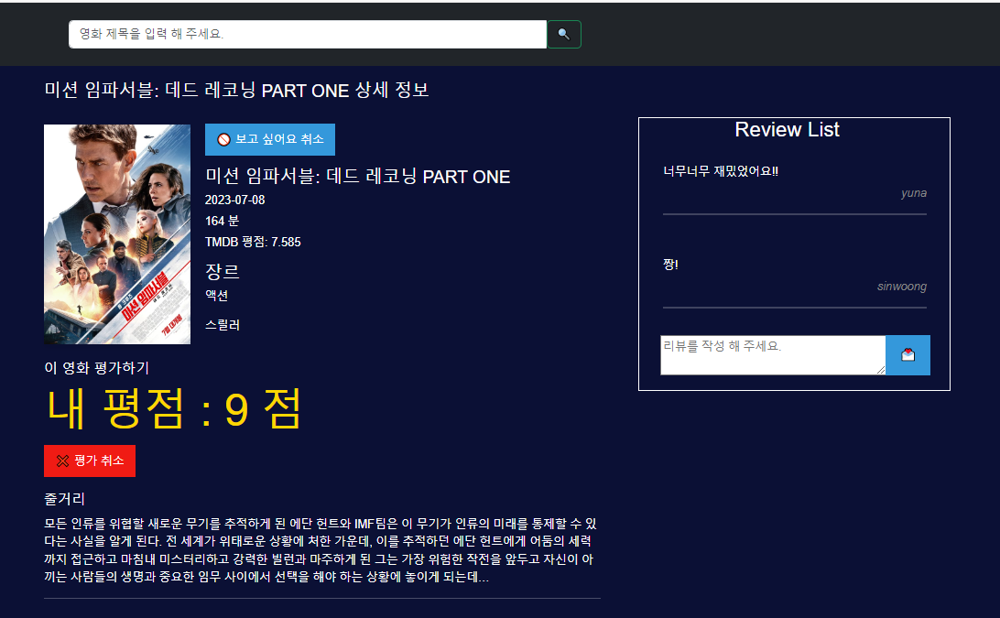

- 리뷰 클릭시 상세 조회 및 댓글 작성 가능
- 작성자만 리뷰 수정, 삭제 가능
- 댓글 작성자만 해당 댓글 삭제 가능
  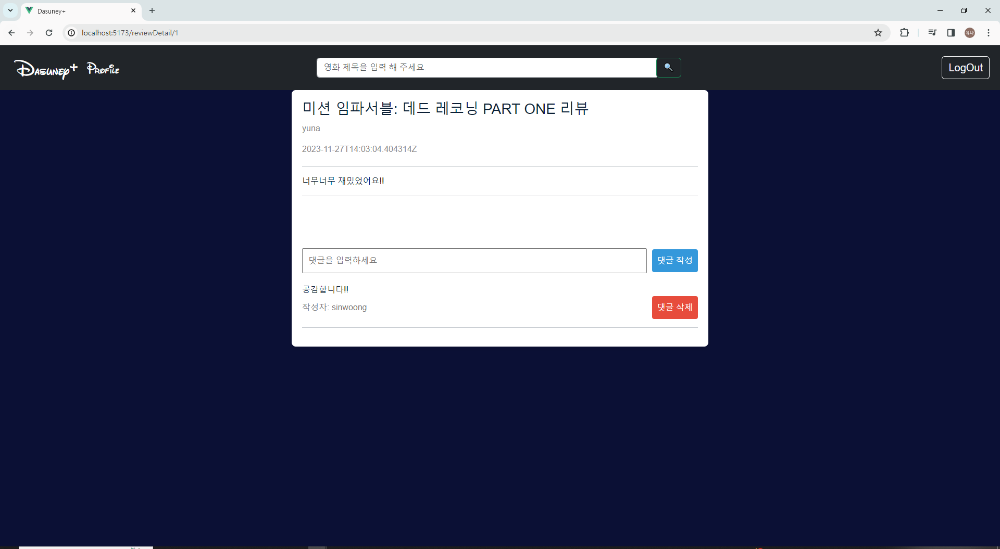
  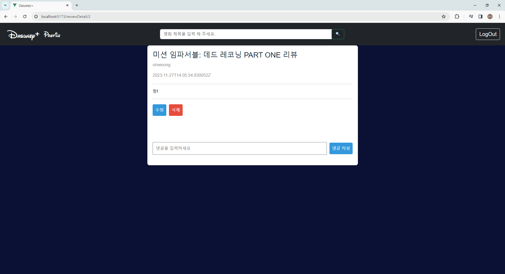

### <프로필 기능>
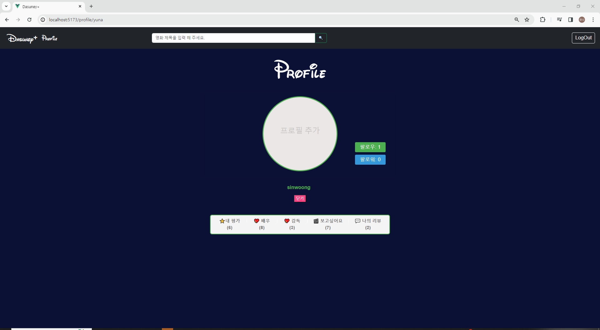

- 팔로우 기능 제공
- 팔로우 , 팔로워 리스트 조회 가능, 해당 사용자 프로필로 바로가기 가능
- 유저가 평가한 영화, 좋아요 누른 배우, 감독, 영화 조회 가능 , 리뷰 쓴 영화 목록과 리뷰 내용 조회 가능

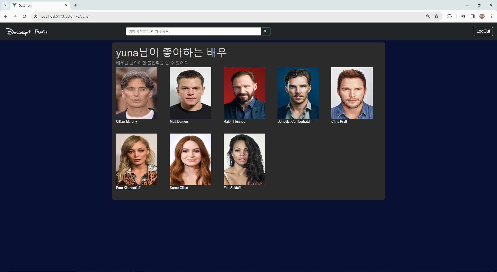
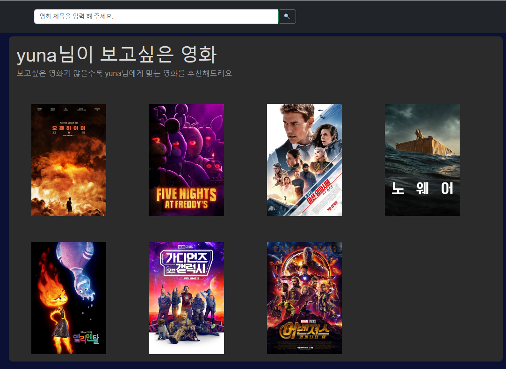

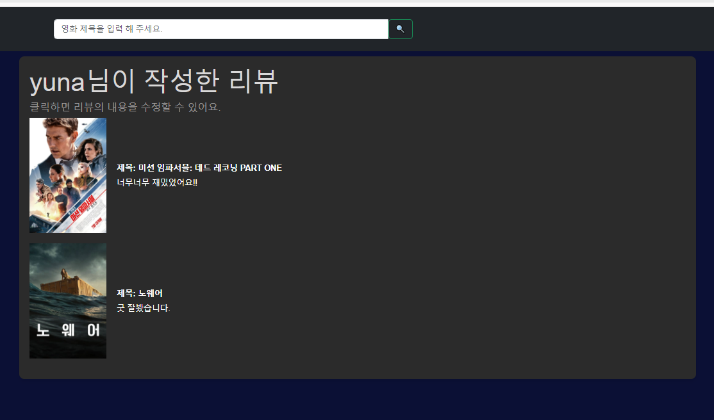

## 🎈 기타(느낀점, 후기 등)

### 목표 서비스 구현 및 실제 구현 정도

- 선택한 영화가 상영중이라면 영화 예매사이트와 연동시켜 바로 예매할 수 있게 해주는 서비스
- OTT로 바로 이동시켜 영화를 볼 수 있게 서비스
   

두 기능도 구현하고자 하였으나 시간 부족으로 구현하지 못함.

### 배운점

- router push는 현재 페이지에서 params 값만 갱신하면서 이동하려고 하면 작동하지 않음.

  - routerview 태그에 key값을 추가하여 해결함
  - `<RouterView :key="$route.path" />`

- 초기 기획의 중요성
  - 컴포넌트 구조를 구성하지 않고 바로 개발에 도입했더니 데이터 요청 방식 때문에 컴포넌트 재사용성이 매우 떨어졌음.
  - 결국 비슷한 기능을 하는 컴포넌트들을 여러개 만들어야했고 시간을 효율적으로 쓰지 못했던 계기가 됐음

## 🎈 산출물

### ERD

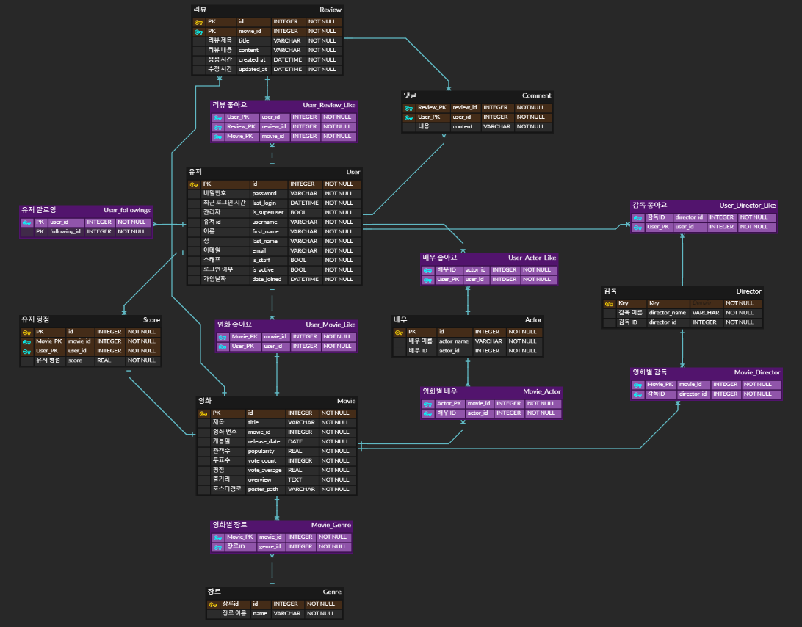

### UseCase

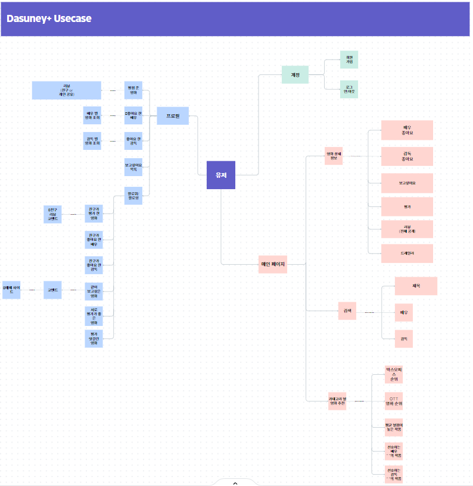

### 스크럼 & 개발 일지

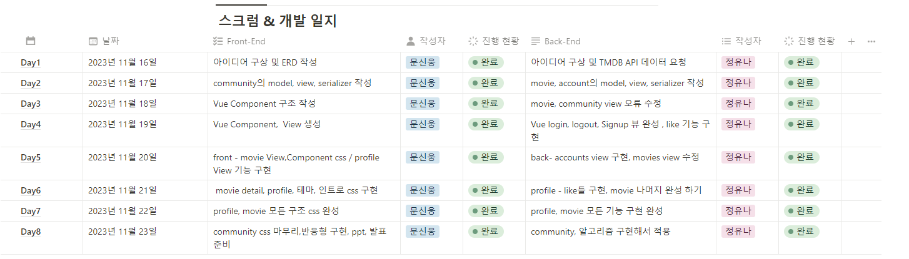

https://www.notion.so/invite/9d1df993ea8139dc85eb44b22e633f0545984d9c
